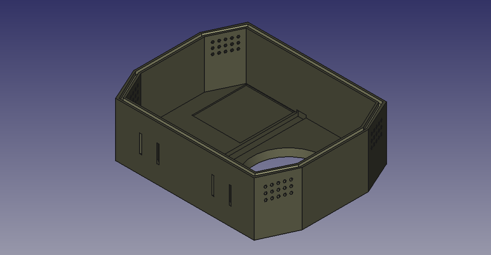
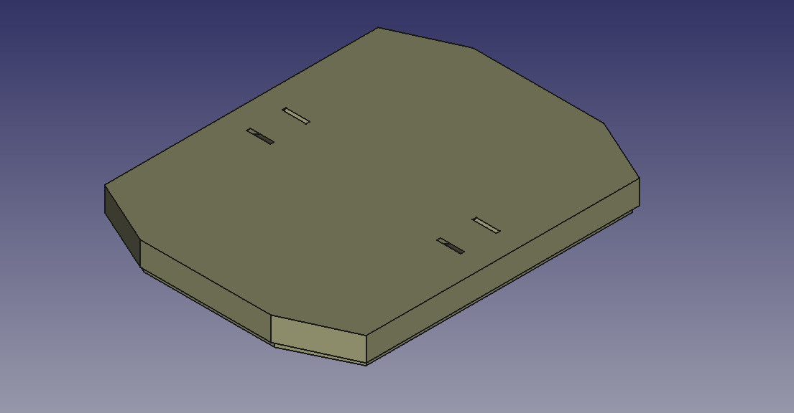
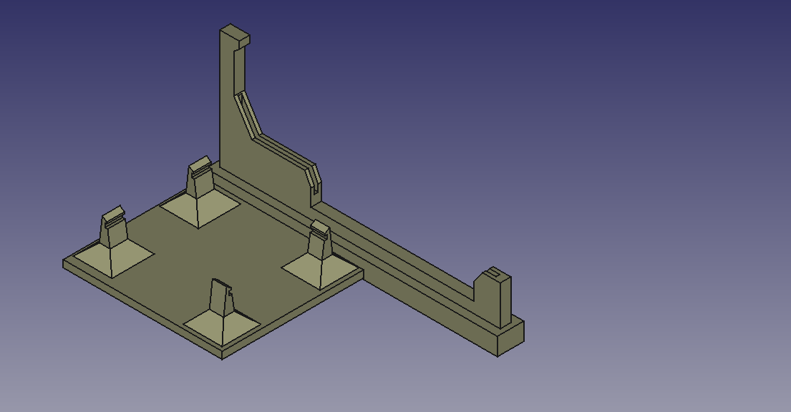
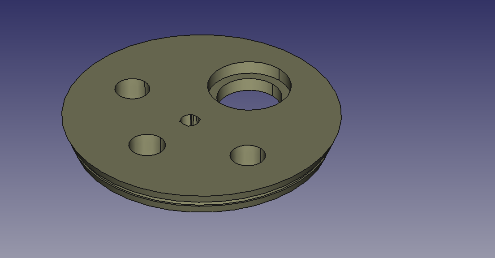

# Prototipo de Carcasa para Dispositivo de Monitoreo de Calidad de Agua

Este repositorio contiene el archivo de diseño 3D para la carcasa (case) de un dispositivo de monitoreo de calidad del agua, desarrollado en el marco del proyecto de investigación PINV01-267.

## Sobre el Proyecto

- **Título del Proyecto:** PINV01-267: Sistema de red de sensores inalámbricos para el monitoreo de la calidad del agua en cauces hídricos del departamento del Canindeyú.
- **Institución:** FACITEC (Facultad de Ciencias y Tecnología - Universidad Nacional de Canindeyú).
- **Financiamiento:** CONACYT (Consejo Nacional de Ciencia y Tecnología).
- **Objetivo:** Desarrollar un sistema informático para el monitoreo de la calidad del agua de cauces hídricos utilizando datos obtenidos a través una red de sensores inalámbricos

## Detalles del Prototipo

El archivo `case-prototype-pinv01-267.FCStd` es el modelo 3D de la carcasa diseñada para proteger los componentes electrónicos y los sensores del dispositivo de monitoreo.

- **Software de Diseño:** FreeCAD
- **Propósito:** Albergar y proteger la placa de procesamiento, los sensores y las baterías en condiciones de campo.
- **Características Principales:**
    - **Diseño Modular:** El case está diseñado para ser modular, permitiendo un fácil ensamblaje y desmontaje.
    - **Componentes Intercambiables:** Los espacios internos están diseñados para encajar las piezas del dispositivo, facilitando el mantenimiento y el intercambio de componentes.
    - **Material:** (Especificar aquí el material recomendado para la impresión 3D, ej. Hyper PLA-CF.

## Componentes del Prototipo

A continuación se describen las partes principales del diseño de la carcasa.

### 1. Carcasa Principal

Es el cuerpo principal del case que alberga todos los componentes. Proporciona la estructura y protección contra impactos y el ambiente. Cuenta con ranuras de amarres para facilitar su fijación en el punto de despliegue.



### 2. Tapa Superior

La tapa sella la carcasa, protegiendo los componentes internos del agua y el polvo. Puede incluir un sello de goma o silicona para mejorar la estanqueidad. Cuenta con ranuras de amarres similares a la carcasa principal para asegurar componentes adicionales como paneles solares.



### 3. Soportes de electrónica

Se han diseñado dos soportes para alojar las placas de procesamiento principal Atlas Scientific i1 Inter Link y Raspberry Pi 4 Model B. Cuenta con monturas para fijar la placa de forma segura.



### 4. Espacio para sensores

Área designada para la instalación de los sensores de calidad de agua (ej. pH, turbidez, temperatura, total de solidos disueltos, etc). El diseño permite encajar los sensores a presión y que estén en contacto con el agua mientras la electrónica permanece aislada.



## Autores y Contacto

- **Investigador Principal:** Daniel Romero
- **Director del proyecto:** Rodrigo Martínez
- **Equipo de Desarrollo:** David Ruiz Diaz, Nazario Ayala, Angel Heimann, Gloria Ortiz.
- **Contacto:** dir.invext@facitec.edu.py

## Licencia

```
MIT License

Copyright (c) 2026 FACITEC / CONACYT Research Project PINV01-267

Permission is hereby granted, free of charge, to any person obtaining a copy
of this software and associated documentation files (the "Software"), to deal
in the Software without restriction, including without limitation the rights
to use, copy, modify, merge, publish, distribute, sublicense, and/or sell
copies of the Software, and to permit persons to whom the Software is
furnished to do so, subject to the following conditions:

The above copyright notice and this permission notice shall be included in all
copies or substantial portions of the Software.

THE SOFTWARE IS PROVIDED "AS IS", WITHOUT WARRANTY OF ANY KIND, EXPRESS OR
IMPLIED, INCLUDING BUT NOT LIMITED TO THE WARRANTIES OF MERCHANTABILITY,
FITNESS FOR A PARTICULAR PURPOSE AND NONINFRINGEMENT. IN NO EVENT SHALL THE
AUTHORS OR COPYRIGHT HOLDERS BE LIABLE FOR ANY CLAIM, DAMAGES OR OTHER
LIABILITY, WHETHER IN AN ACTION OF CONTRACT, TORT OR OTHERWISE, ARISING FROM,
OUT OF OR IN CONNECTION WITH THE SOFTWARE OR THE USE OR OTHER DEALINGS IN THE
SOFTWARE.
```